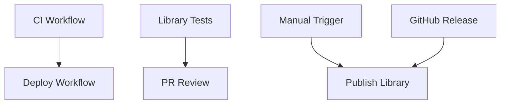

# GitHub Workflows Documentation

This document describes the GitHub Actions workflows configured for the room-planner Angular library project.

## Workflows Overview

### 1. 🔧 **CI Workflow** (`ci.yml`)

**Triggers:**

- Push to `main` branch
- Pull requests to any branch

**Purpose:** Validates code quality, builds library and sample app

**Steps:**

1. **Setup** - Checkout, install pnpm, Node.js, dependencies
2. **Quality Checks** - Lint code using ESLint and Angular linting rules
3. **Library Build** - Build the room-planner Angular library
4. **Library Tests** - Run unit tests for the library components and services
5. **Sample App Build** - Build the sample application demonstrating library usage
6. **Verification** - Verify build artifacts and package structure
7. **Upload Artifacts** - Store both library and sample app builds for deployment

**Artifacts Created:**

- `room-planner-lib` - Built Angular library package
- `room-planner-sample-app` - Built sample application

---

### 2. 🚀 **Deploy Workflow** (`deploy.yml`)

**Triggers:**

- Successful completion of CI workflow on `main` branch

**Purpose:** Deploy sample app to GitHub Pages for library demonstration

**Steps:**

1. **Download** - Get sample app build from CI workflow
2. **Verify** - Check deployment files and structure
3. **Setup Pages** - Configure GitHub Pages deployment
4. **Deploy** - Deploy sample app to GitHub Pages
5. **Notify** - Log deployment success and provide URLs

**Output:**

- Live sample app at GitHub Pages URL
- Demonstrates library functionality
- Provides usage examples for developers

---

### 3. 🧪 **Library Tests** (`library-tests.yml`)

**Triggers:**

- Pull requests affecting library files
- Changes to configuration files

**Purpose:** Focused testing for library changes in PRs

**Steps:**

1. **Setup** - Standard environment setup
2. **Lint** - Code quality checks specific to library
3. **Test** - Run library unit tests
4. **Build** - Build library package
5. **Verify** - Validate package structure and exports
6. **Installation Test** - Test library installation process
7. **PR Comment** - Add build summary to pull request

**Features:**

- Triggers only on library-related changes
- Provides detailed PR feedback
- Tests library as a standalone package

---

### 4. 📦 **Publish Library** (`publish-library.yml`)

**Triggers:**

- Manual workflow dispatch with version type selection
- GitHub releases (published)

**Purpose:** Publish library to npm registry

**Steps:**

1. **Setup** - Standard environment with npm registry auth
2. **Quality Gates** - Run tests and linting
3. **Build** - Build library for publication
4. **Version** - Bump version based on input (patch/minor/major)
5. **Commit** - Update version in git
6. **Tag** - Create git tag for release
7. **Publish** - Publish to npm registry
8. **Release** - Create GitHub release with changelog

**Requirements:**

- `NPM_TOKEN` secret configured in repository
- Proper npm registry access

---

## Workflow Dependencies



## Configuration Requirements

### Repository Secrets

1. **`NPM_TOKEN`** - Required for publishing to npm
   - Generate at [npmjs.com](https://www.npmjs.com/)
   - Scope: Automation token with publish access

### GitHub Pages

1. **Enable GitHub Pages** in repository settings
2. **Source:** GitHub Actions
3. **Permissions:** Read/Write for GitHub Actions

### Branch Protection

Recommended branch protection rules for `main`:

1. **Require PR reviews** - At least 1 review
2. **Require status checks** - CI workflow must pass
3. **Restrict pushes** - Only allow through PRs
4. **Include administrators** - Apply rules to all users

## Local Development Commands

These commands mirror what the workflows execute:

```bash
# Quality checks (CI workflow)
pnpm run lint
pnpm run test:lib --watch=false
pnpm run build:lib
pnpm run build:sample

# Library testing (Library Tests workflow)
pnpm run lint
pnpm run test:ci

# Package verification
ls -la dist/room-planner-lib/
cat dist/room-planner-lib/package.json

# Manual library packaging
pnpm run pack:lib
```

## Troubleshooting

### Common Issues

1. **Build Failures**
   - Check Node.js version compatibility
   - Verify all dependencies are properly installed
   - Ensure TypeScript compilation succeeds

2. **Test Failures**
   - Run tests locally: `pnpm run test:lib`
   - Check browser compatibility for headless Chrome
   - Verify test environment setup

3. **Deploy Failures**
   - Check artifact upload/download steps
   - Verify GitHub Pages is enabled
   - Ensure proper permissions are set

4. **Publish Failures**
   - Verify `NPM_TOKEN` is configured
   - Check npm package name availability
   - Ensure version numbers are valid

### Workflow File Locations

- `.github/workflows/ci.yml` - Main CI pipeline
- `.github/workflows/deploy.yml` - GitHub Pages deployment
- `.github/workflows/library-tests.yml` - PR-focused library testing
- `.github/workflows/publish-library.yml` - npm publishing

### Monitoring

Monitor workflow execution in:

- **Repository → Actions tab**
- **Individual workflow runs** for detailed logs
- **Artifacts section** for build outputs
- **GitHub Pages settings** for deployment status
